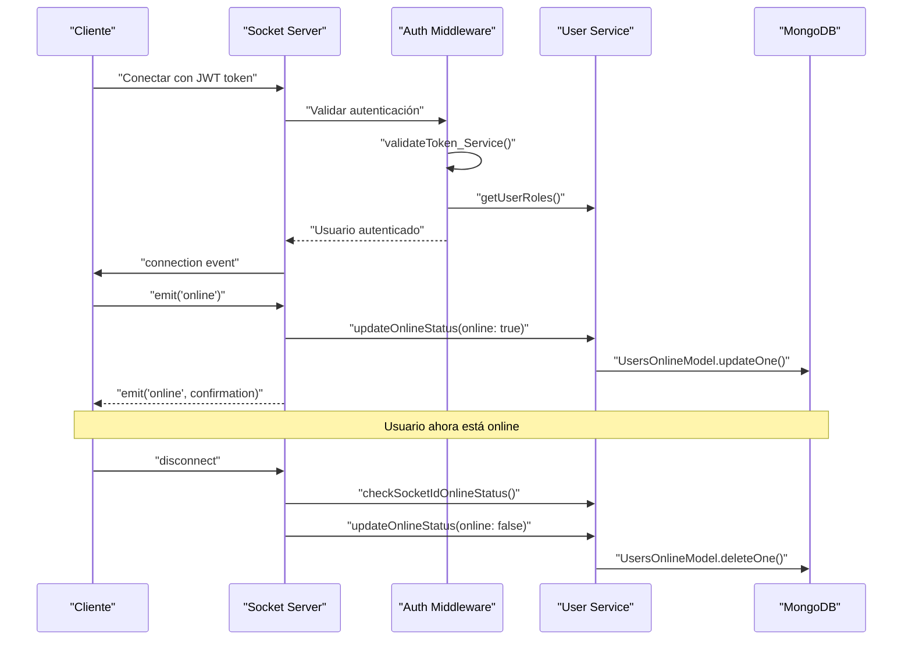
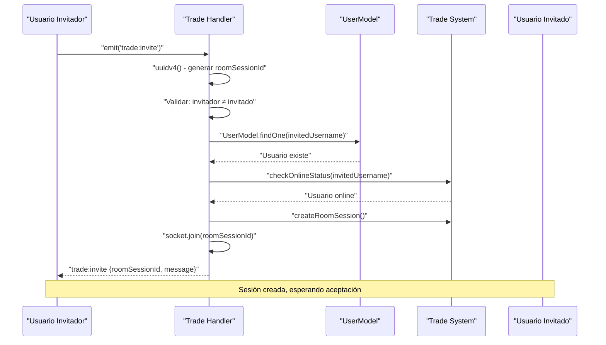
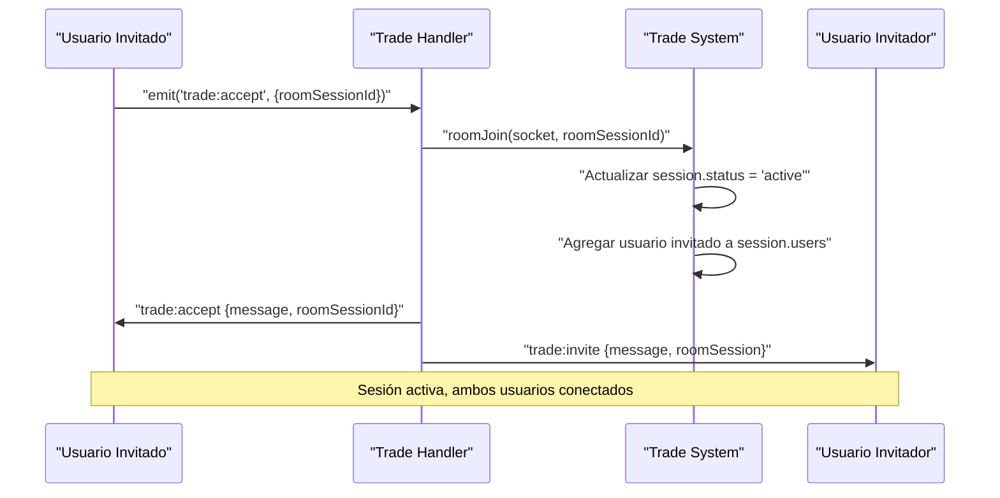
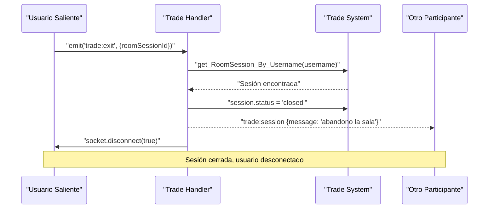

## Estado Online de los Usuarios

El sistema gestiona de forma activa el **estado online** de los usuarios a través de conexiones WebSocket autenticadas mediante JWT. Cada vez que un usuario se conecta, se valida su token y, una vez autenticado, se registra su estado como `online` en la base de datos. Este estado se actualiza dinámicamente y se elimina al desconectarse el cliente, lo que garantiza precisión y limpieza en tiempo real.

Este flujo es fundamental para mantener sincronizados los estados de conexión en funcionalidades como presencia, notificaciones o sistemas de intercambio.

El siguiente diagrama resume el flujo completo:


El sistema implementa un patrón de seguridad robusto donde:
- La autenticación JWT es obligatoria para todas las conexiones socket
- El estado online se mantiene en la colección `Users_Onlines` con cleanup automático
- La función `secureOn` valida el estado online antes de procesar eventos
- Al desconectarse, el sistema limpia automáticamente el estado online del usuario

### Eventos de Trade Disponibles

El sistema maneja tres tipos de eventos trade principales:

#### 1. `trade:invite` - Crear Invitación de Intercambio

Este evento permite a un usuario crear una nueva sesión de intercambio e invitar a otro usuario.

**Funcionalidad:**
- Genera un `roomSessionId` único usando `uuidv4()`
- Valida que el usuario no se invite a sí mismo
- Verifica que el usuario invitado existe en la base de datos
- Confirma que el usuario invitado está online
- Crea la sesión de intercambio y une al creador a la sala

#### 2. `trade:accept` - Aceptar Invitación de Intercambio

Este evento permite al usuario invitado aceptar una invitación de intercambio existente.

**Funcionalidad:**
- Une al usuario invitado a la sala de intercambio
- Cambia el estado de la sesión a 'active'
- Notifica a ambos participantes que la sesión está activa

#### 3. `trade:exit` - Salir de Sesión de Intercambio

Este evento permite a cualquier participante abandonar una sesión de intercambio activa.

**Funcionalidad:**
- Verifica que el usuario esté en una sesión activa
- Cambia el estado de la sesión a 'closed'
- Notifica al otro participante sobre el abandono
- Desconecta al usuario que sale

### Diagramas de Flujo de Usuario

#### Diagrama: trade:invite (Crear Invitación)



#### Diagrama: trade:accept (Aceptar Invitación)



#### Diagrama: trade:exit (Salir de Sesión)



### Modelo de Datos de Sesión

Las sesiones de trade utilizan el modelo `TradeSession`:

````ts
interface TradeSession {
  roomSessionId: string;
  users: {
    [username: string]: {
      socketId: string;
      role: 'owner' | 'guest' | string;
      trade_status: 'waiting' | 'ready' | 'accepted' | 'denied' | string;
      connected: boolean;
      offeredCardIds: string[];
    };
  };
  status: 'waiting' | 'active' | 'denied' | 'closed';
  lastUpdated: string; // ISO timestamp
}
````

### SecureOn (middleware)

Todos los eventos trade están protegidos por el wrapper `secureOn` que valida la autenticación y estado online del usuario antes de procesar el evento. El sistema utiliza mapas en memoria para gestionar las sesiones activas y mantiene sincronización entre sockets y sesiones de intercambio.
